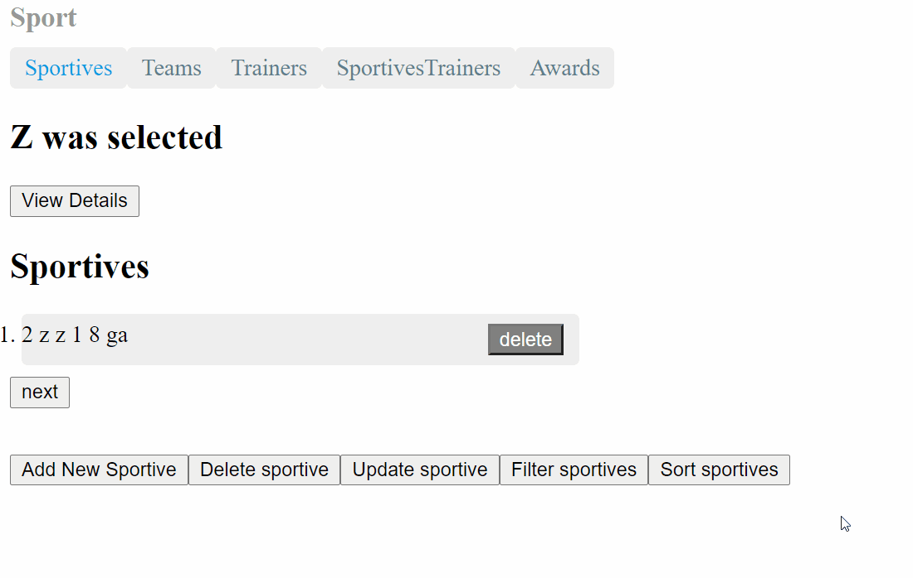

# SportApp

-I implemented an application in Java with backend and frontend.
-For the backend I used Tomcat and for the frontend Angular.
-For the database I used PostgreSQL.
-I have multiple types of relations between entities: one to one, one to many and many to many.

